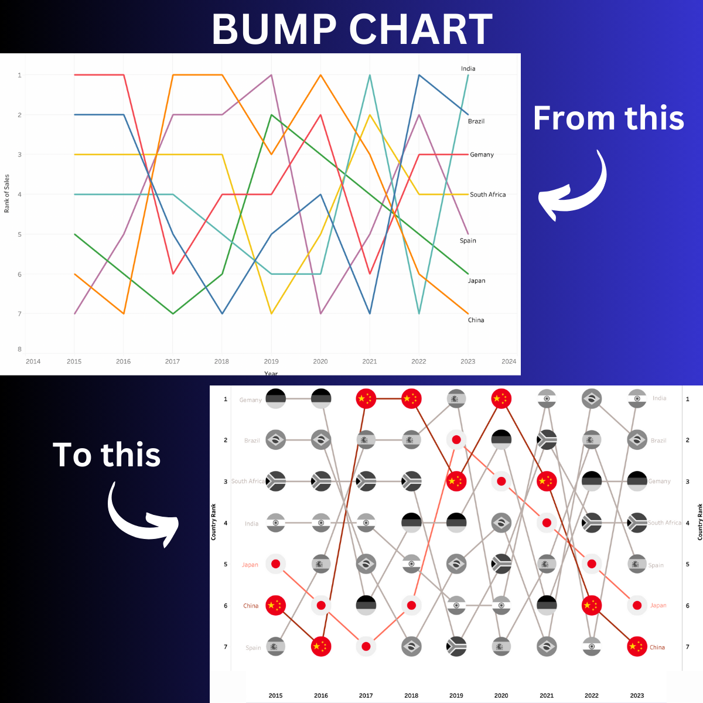

# Tableau Bump Chart Tutorial

This repository contains a step-by-step tutorial on creating a bump chart in Tableau, from beginner to advanced level. The tutorial demonstrates how to create a bump chart using fake sales data for 7 countries from 2015 to 2023.

## Table of Contents

1. [Introduction](#introduction)
2. [Dataset](#dataset)
3. [Steps](#steps)
4. [Files](#files)
5. [Final Visual](#final-visual)
6. [Conclusion](#conclusion)

## Introduction

Bump charts help visualize rank changes over time. In this tutorial, we'll create a bump chart in Tableau using fake sales data for 7 countries from 2015-2023. 

## Dataset

The dataset used in this tutorial consists of fake sales data for 7 countries: USA, Canada, UK, Germany, France, Japan, and Australia. The data spans from 2015 to 2023 and includes variables such as country, year, and sales.

## Steps

The tutorial is divided into 5 steps, starting from beginner level and progressing to advanced techniques for enhancing the bump chart. Each step builds upon the previous one, demonstrating additional features and improvements.

1. **Step 1**: Setting up the basic bump chart.
2. **Step 2**: Customizing axis and labels.
3. **Step 3**: Adding interactivity with parameters.
4. **Step 4**: Highlighting specific countries.
5. **Step 5**: Fine-tuning visual aesthetics.

Refer to the provided PDF document for detailed instructions and takeaways at each step.

## Files

- `dataset.csv`: Fake sales data used in the tutorial.
- `tableau_file.twbx`: Tableau workbook containing the bump chart visualization.
- `tutorial_steps.pdf`: PDF document demonstrating the 5 steps with takeaways and screenshots.

## Final Visual

The final bump chart visualizes sales rank changes across 7 countries from 2015 to 2023. It incorporates interactive features, custom axis labels, and improved aesthetics for better readability.

## Conclusion

Bump charts are powerful tools for visualizing rank changes over time, and Tableau provides a versatile platform for creating them. By following the steps outlined in this tutorial, you can create insightful bump charts to analyze various trends and patterns in your data.
